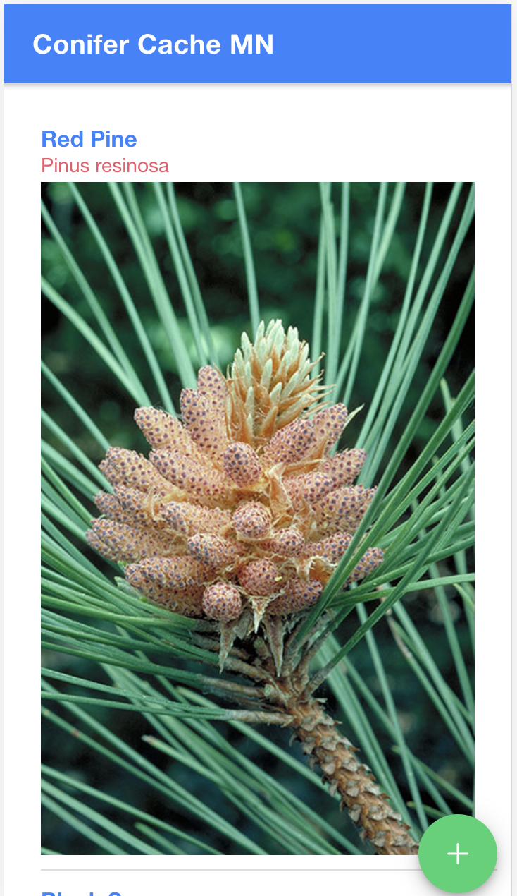
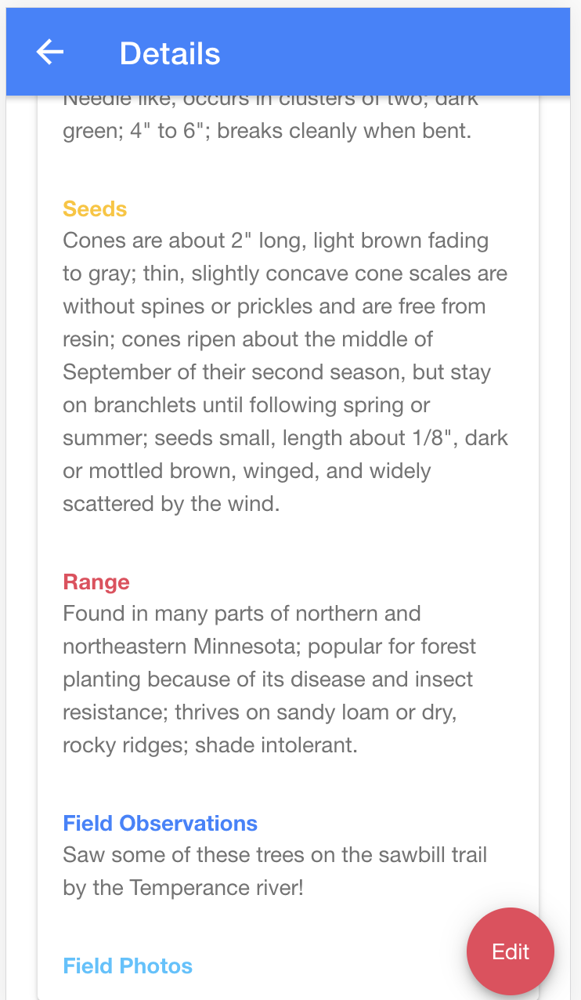
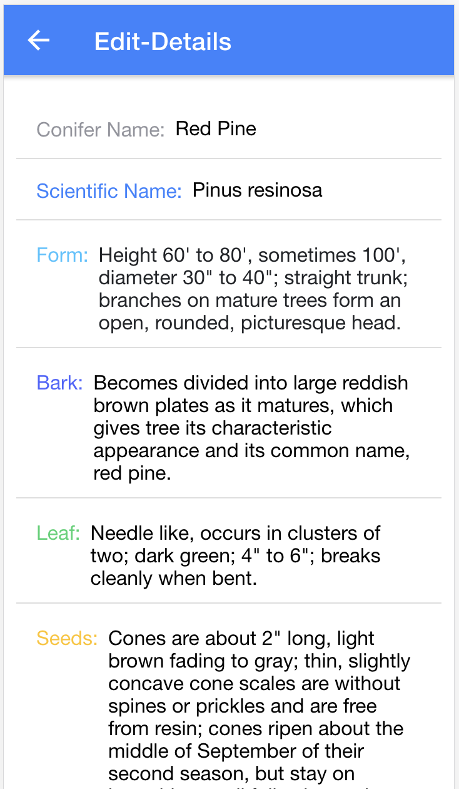

# Conifer Cache MN
---

## Description

Duration: 1 Week Sprint

- For this code challenge I built a Conifer Cache MN application!
This app allows you to create update and delete conifers in your firebase database.  It will list all conifers you have created on the Home page.  We are also able to see a detailed view for each individual conifer including information such as name, scientific name, form, bark, leaf, seeds, range, image of the conifer, and field observations.  We're also able to edit our conifer's name, scientific name, form, bark, leaf, seeds, range, image URL, and field observations.
- This list of conifers is just a part of a larger idea of having a nature journal.  Future development of this project would include the ability to upload photos you've taken while out in the field.  I would also like to expand the idea to include lists of other parts of the MN ecosystem such as Deciduous trees, birds, common mammals, reptiles, etc.  The goal would be to have an app where you could record your personal experiences and observations of the natural world while also educating yourself about MN's robust ecosystem.

## Database Setup

1. Create a database with Firebase
2. Find the configuration for your new database and copy it
3. paste the configuration info in the environment.ts file
 
---
Link
---
---
Screen shot

---

## Installation

1. fork this repository to your own github account
2. git clone onto local computer using terminal
3. open with code editor of your choice
4. make sure you have node installed on your computer
5. npm install -g @ionic/cli
5. npm install firebase angularfire 2
6. npm ionic serve
---

## Usage

1. create personalized list of conifers you are interested in by clicking the "+" button on home page in bottom right corner
2. use the internet to find information about each species or use your own knowledge to fill out fields
3. find images online and copy image address and paste into the imageURL input field
4. click save to store information to your personal firebase
5. click edit button on /details page to edit any information or add new image
6. click save to save new information to firebase
7. continue to add new conifers when you are interested or find them in the field

---
## Built With

- html
- css
- scss
- typescript
- node
- firebase
- cloud firestore
- angularfire2
- angular
- ionic

---
## Acknowledgment 

- Thanks to Cloudburst for giving me this code challenge
- Thanks to the MN DNR website and their photographers for many of the pictures and information used in this educational app
- Thanks to Prime Digital Academy for giving me the skills to work through this project that contains many technologies totally new to me
---
## Support

If you have suggestions or issues, please email me at <Luke.Schleder@gmail.com>
